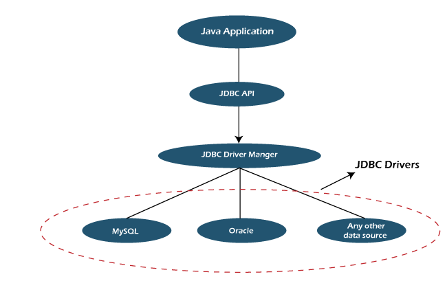

# JDBC

JDBC stands for Java Database Connectivity. JDBC is a Java API to connect and execute the query with the database. 

# Why JDBC?

- Database Connectivity: JDBC allows Java applications to connect to various databases without having to deal with the underlying details of the database connection process. It abstracts away the differences in database-specific connection mechanisms.

- Database Access: With JDBC, Java applications can execute SQL queries and statements on databases to retrieve, insert, update, and delete data. This facilitates data manipulation and retrieval operations in a consistent and efficient manner.

- Platform Independence: JDBC provides a consistent API for database access across different platforms. This means that you can write your database code in Java once and run it on different operating systems without major modifications.

- Security: JDBC provides mechanisms for handling authentication and secure communication between the Java application and the database. This ensures that sensitive data remains protected during transmission.

- Performance: JDBC enables efficient interaction with databases by providing features like prepared statements and batch processing. Prepared statements can be precompiled and reused, reducing the overhead of repeatedly compiling SQL queries. Batch processing allows executing multiple statements in a single database round-trip, improving performance for data manipulation tasks.

- Transaction Management: JDBC supports transaction management, allowing you to group multiple database operations into a single transaction. This ensures that either all the operations within a transaction are successful, or none of them are applied, maintaining data consistency.

- Concurrency Control: JDBC provides facilities to handle concurrent access to the database. You can control how multiple threads or processes interact with the database to avoid data corruption or inconsistency.

- Data Source Management: JDBC supports the use of connection pools, which efficiently manage a pool of database connections that can be reused by different parts of your application. This reduces the overhead of creating and closing connections for every database operation.

- Adoption of Object-Oriented Paradigm: While relational databases use SQL for data manipulation, Java applications use an object-oriented paradigm. JDBC bridges this gap by allowing developers to map database records to Java objects using Object-Relational Mapping (ORM) frameworks.

- Integration with Java Applications: Since Java is a widely-used programming language, integrating database access into Java applications is crucial. JDBC provides the necessary tools and interfaces to incorporate database functionality seamlessly into Java programs.

# Architecture of JDBC

- Application: It is the Java servlet or an applet that communicates with the data source.

- The JDBC API: It allows the Java programs to perform the execution of the SQL statements and then get the results.

- DriverManager: DriverManager plays a crucial role in the architecture of JDBC. It uses database-specific drivers to connect the enterprise applications to various databases.

- JDBC drivers: To interact with a data source with the help of the JDBC, one needs a JDBC driver which conveniently interacts with the respective data source.

# Set JDBC Driver classpath

- Download mysql-connector-j-8.1.0.jar.

- Open Intellij Idea

- Click Flie > Project Structure > Modules > Dependencies > '+' > Add Jar or Directories

- Select the mysql-connector-j-8.1.0.jar file and Done.

# Java Database Connectivity 

There are 5 steps to connect any java application with the database using JDBC. These steps are as follows:

- Register/Load the Driver class

    Class.forName("com.mysql.jdbc.Driver");  

- Create connection

    Connection con=DriverManager.getConnection(  
"URL","USER NAME","PASSWORD");

    eg.
    Connection con=DriverManager.getConnection(  
"jdbc:mysql://localhost:3307/DBNAME","USER NAME","PASSWORD");

- Create Query | Statement | PreparedStatement | CallableStatement

    String q = "select * from students";

    Statement stmt=con.createStatement();

- Execute queries

    ResultSet set = stmt.executeQuery(q);

    while(rs.next()){  
        System.out.println(set.getInt(1)+" "+set.getString(2));  
    }  
    
- Close connection
    
    con.close();  
